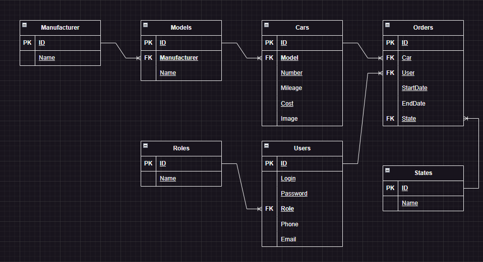

# Прокат автомобилей

## Содержание

1. [Описание предметной области](#описание-предметной-области)
2. [Таблицы](#таблицы)
   1. [Cars](#cars)
   2. [Models](#models)
   3. [Manufacturers](#manufacturers)
   4. [Users](#users)
   5. [Roles](#roles)
   6. [Orders](#orders)
3. [ER диаграмма](#er-диаграмма)

## Описание предметной области

Компания предоставляет подневный прокат автомобилей разных моделей. Цена может меняться в зависимости от марки и пробега автомобилей.

## Таблицы

### Cars

| Имя поля |    Тип данных    | Ограничение |
|----------|:----------------:|:-----------:|
| ID       |      `int`       |   Primary   |
| Model    |      `int`       |   Foreign   |
| Number   |    `nchar(8)`    |   Unique    |
| Mileage  |      `int`       |      -      |
| Cost     | `decimal(12, 2)` |      -      |

### Models

| Имя поля     |   Тип данных   | Ограничение |
|--------------|:--------------:|:-----------:|
| ID           |     `int`      |   Primary   |
| Manufacturer |     `int`      |   Foreign   |
| Name         | `nvarchar(32)` |   Unique    |

### Manufacturers

| Имя поля |   Тип данных   | Ограничение |
|----------|:--------------:|:-----------:|
| ID       |     `int`      |   Primary   |
| Name     | `nvarchar(32)` |   Unique    |

### Users

| Имя поля |  Тип данных   | Ограничение |
|----------|:-------------:|:-----------:|
| ID       |     `int`     |   Primary   |
| Login    | `varchar(16)` |   Unique    |
| Password |  `char(64)`   |      -      |
| Role     |     `int`     |   Foreign   |

### Roles

| Имя поля |  Тип данных   | Ограничение |
|----------|:-------------:|:-----------:|
| ID       |     `int`     |   Primary   |
| Name     | `varchar(16)` |   Unique    |

### Orders

| Имя поля  | Тип данных | Ограничение |
|-----------|:----------:|:-----------:|
| ID        |   `int`    |   Primary   |
| Car       |   `int`    |   Foreign   |
| User      |   `int`    |   Foreign   |
| StartDate |   `date`   |      -      |
| EndDate   |   `date`   |      -      |
| State     |   `int`    |      -      |

## ER диаграмма

